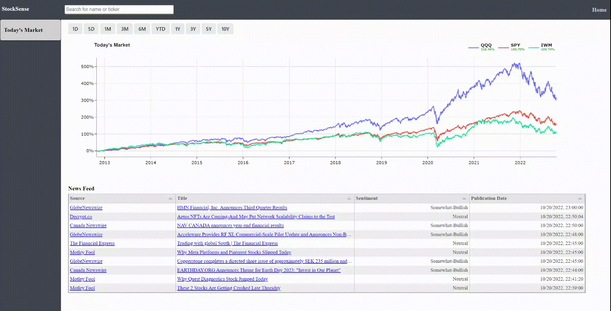
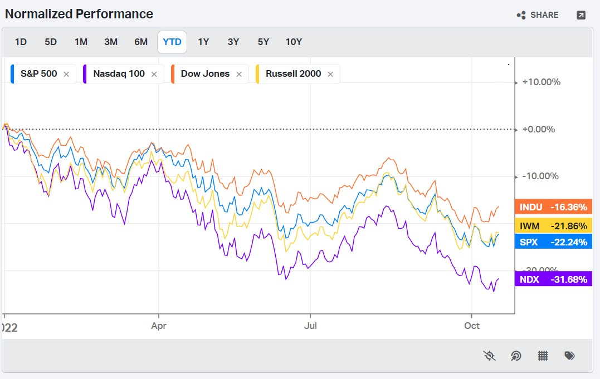

# Hands Off JS with HTMX

### Intro and Inspiration

There is an amazing amount of interactivity that can be achieved on a website without
needing to use `JavaScript`. To demonstrate this idea, this repository runs the
following [site](http://dashboard.zmaytechstack.com/) with almost no `js`.
There were a few goals in mind:

1. Implement just a few of the features that are a part of [koyfin's](https://app.koyfin.com/) website without any `js`
   and in doing so show that you can get a lot of the same feel and functionality as a site using a
   front-end framework (e.g., `REACT`).
2. Show a more decently robust example, but that is also very simple
   and easy to follow.
3. Minimal `JavaScript` Dependencies. Only three were needed:
    1. [HTMX](https://htmx.org/)
    2. [Plotly](https://plotly.com/python/)
    3. [Tabulator](http://tabulator.info/)

We will walk through a couple of the features, but I'd encourage those interested
to explore the code to get a better sense of what is going on.
Setup instructions are provided in the appendix.

**Full Disclosure:** *I am using the [Alpha Vantage](https://www.alphavantage.co/) free API
and only have 5 API hits per minute, so you can imagine that the site does not scale well!
I do my best to cache results in S3, but only so much can be done.*

The site has the following functionality without javascript:

1. Updating the chart based on timeframe selection.
2. Search bar to find US listed securities.
3. Polling to update the news feed every 5 minutes.

All can be seen on the homepage:


None of these features use `javascript` (although the table does rely on the `javascript` package Tabulator).
To generate server-side requests, we use the [htmx](https://htmx.org/) package.
Instead of sending json between the server and the browser, you send html and make
server-side requests directly in the html, such as: `<a hx-post="/click">Click Me!</a>`.

### An Example

The way the site uses this package can be shown with the cumulative return chart on the
landing page. What we are going to demonstrate is that using htmx, we generate routes that
act as components on the page and not page reload routes (i.e., we are only replacing
certain sections of the DOM, not the entire DOM). We first generate a post request with
the following [code](https://github.com/azakmay/dashboard-sample/blob/master/apps/templates/home/macros.html).

```html




<div class="trigger-button"
     hx-post="/chart/cum_returns"
     hx-trigger="click"
     hx-target="#market-chart"
     hx-vals='{"window": "L10Y"}'
     id="{{ button }}">{{ button }}
</div>


``` 

Let's quickly explain each of the `hx-` attributes:

1. `hx-post`: This will be a post request to the `/chart/cum_returns` endpoint.
2. `hx-trigger`: determines that the post request will occur on a click event
3. `hx-target`: determines where to put the response of the post request. Since the
   endpoint sends back html, it will put the html inside the following div:
   `<div id="market-chart" class="container">`
4. `hx-vals`: `json` data to send to the server as part of the request. Here it would
   send the value `L10Y` to the plot endpoint to determine the length of the
   cumulative returns plot.

The `/chart/cum_returns` endpoint is as simple as below:

```python
@application.route('/chart/cum_returns', methods=['GET', 'POST'])
def chart_cumreturns():
    view = MarketView()
    return view.get_daily_market_chart_html()
```

All we are doing is using [Plotly](https://plotly.com/python/) and some
templating around `express.line(data)` to build charts in `Python` with certain
request paramaters. This generates html to replace the plot on the screen with an updated 
version without needing to do a full page reload.



Just like that, with no `js`, we can generate a chart with similar functionality
to that on [https://app.koyfin.com/](koyfin).



### Benefits

There are a few benefits to generating the html on the server side with htmx:

1. No full page reloads
2. Language consistency: Stay in the same language as the backend code (e.g., `Python` used here)
3. Rapid prototyping: Easier to get a bunch of visuals - think dashboards - up in less time
4. Easier for all programmers to be full stack
5. **Most Important:** No JS or front-end framework!

### Conclusion

Mission accomplished!


This is not a bad approach if you're building a site and maintaining it yourself.
In fact, this isn't a bad approach for software at scale. Here is a post that recently showed up at the top
of [hackernews](https://htmx.org/essays/a-real-world-react-to-htmx-port/) about HTMX being
used for a large scale software product.

## Appendix

### Setup

If you would like to run this locally, you will need to setup the following environment
variables:

```dotenv
STOCK_API_KEY
DATA_BUCKET
```

1. The API can be retrieved [here](https://www.alphavantage.co/support/#api-key)
2. The data bucket must be setup on S3 with AWS. This is used as a cheap cache to
   store parquet files of data previously requested since we didn't feel like storing data
   in a DB.

As long as you setup these environment variables, you should be able to setup a virtual
environment, `pip install -r requirements.txt` and be good to go.

### Tools and Tech

1. Htmx
2. Flask
3. CSS: Mostly Grid and Flex
4. Alpha Vantage API
5. AWS S3 and Elastic Beanstalk
